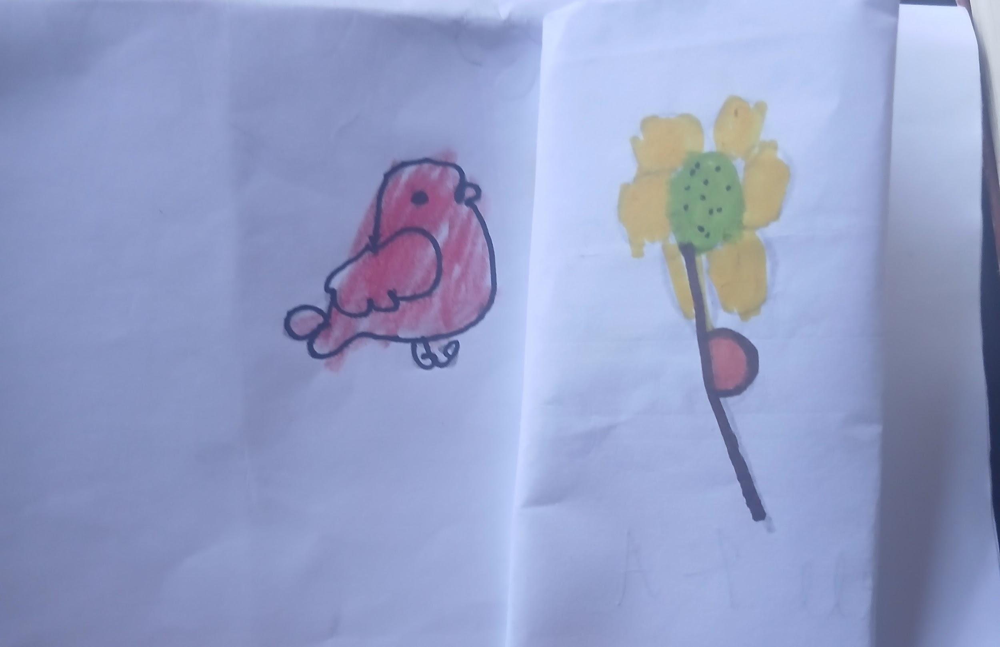

## Apresentação

**Aquilo que quer ser palavra**

Escreva aqui a apresentação do projeto: o que inspirou o livro, como foi feito e quem participou. Este texto flui automaticamente para quantas páginas forem necessárias — basta escrever mais parágrafos.

Cada parágrafo, separado por uma linha em branco, vira um bloco de texto na página. Você também pode usar *itálico* e **negrito** normalmente.

## Conto

Era uma vez uma flor que era muito solitária, até que, um belo dia, um pássaro
apareceu. 

---

O pássaro se aproximou da flor e percebeu que ela estava triste. Então,
perguntou o que havia acontecido, e ela respondeu que se sentia muito sozinha.

---

Ele perguntou se ela gostaria de ter companhia, e ela aceitou. Os dois começaram
a conversar sobre a vida e ficaram ali, trocando histórias até o anoitecer.

---

Quando ficou bem tarde, os dois foram dormir. No dia seguinte, o pássaro saiu
para procurar comida para eles, enquanto a flor ficou esperando por ele. De
repente, começou a chover, e a flor ficou toda molhada.

---

O pássaro demorou um pouquinho, e a flor já estava achando que ele a tinha abandonado de vez. Demorou um tempinho que, para a flor, pareceu uma eternidade. Mas o pássaro voltou para ficar de vez, e a flor ficou tão contente! Dali em diante, eles continuaram juntos e viveram felizes para sempre.

## Sobre a autora

Escreva aqui a biografia do autor ou da autora: nome, idade, onde mora e o que gosta de fazer.

## Ilustradores

### Nome do Ilustrador(a) da Capa

**Ilustrações da capa**

Escreva aqui um pequeno texto sobre quem ilustrou a capa: idade, hobbies e o que mais gosta.

### Nome do Ilustrador(a) do Conto

**Ilustrações do conto**

Escreva aqui um pequeno texto sobre quem ilustrou o conto: idade, hobbies e o que mais gosta.

## A equipe

